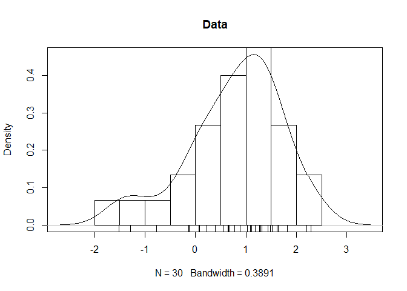
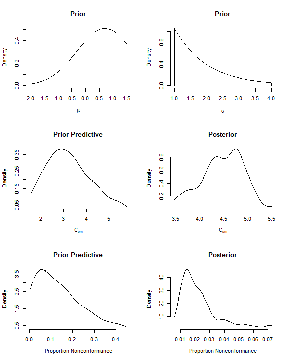
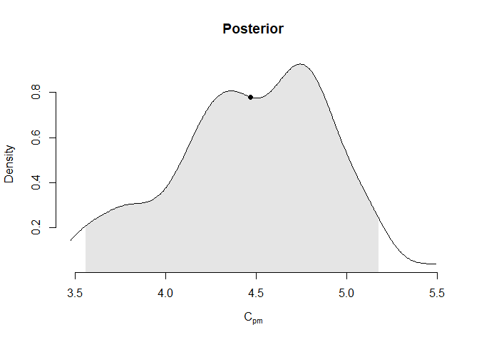
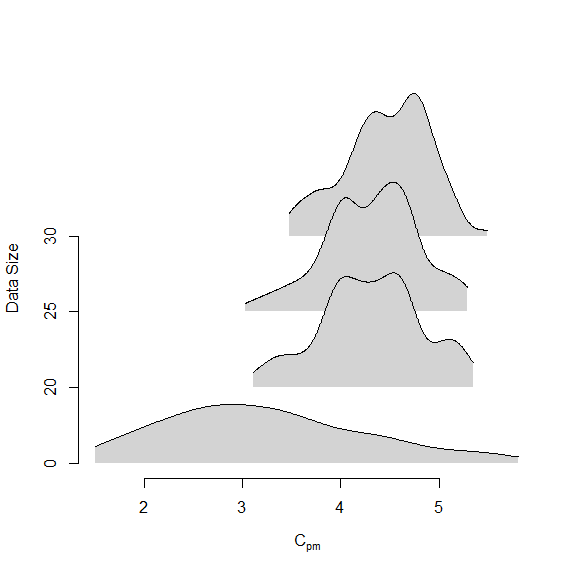
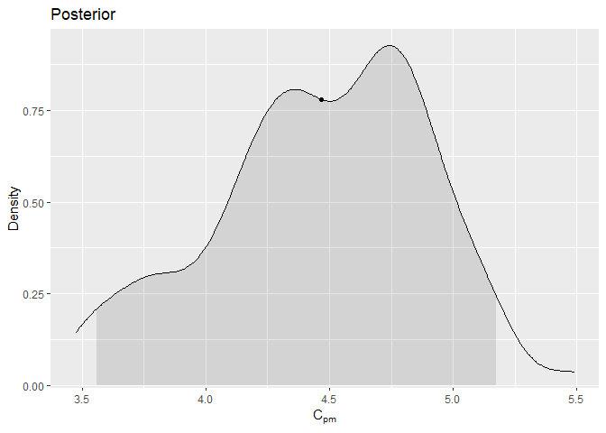
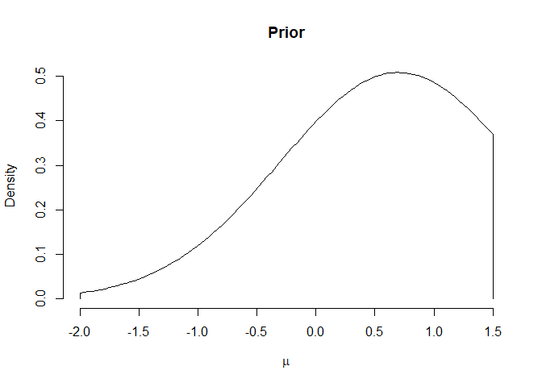
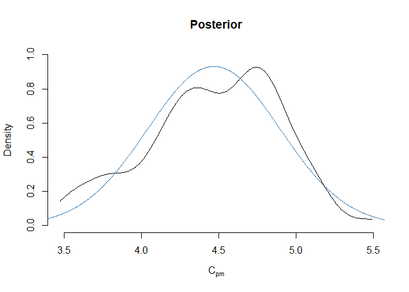

<!-- README.md is generated from README.Rmd. Please edit that file -->

# pcj

**Development version: 0.0.0.9001**

``` r
library(pcj)

# Default libraries.
library(grDevices)
library(graphics)
library(stats)
```

``` r
set.seed(1L)
data = stats::rnorm(30L, mean = .7, sd = 1L)

plot(stats::density(data), main = "Data")
graphics::hist(data, add = TRUE, freq = FALSE, col = NA)
graphics::rug(data)
```



# The S3 Way

``` r
model = pcj:::new_pcj_process_capability_model1(
  data,
  pcj::new_pci_parameters1(c("C_p", "C_pk", "C_pm"), 0, -3, 3, 1),
  "dnorm(.7, 1)T(-2, 1.5)",
  "dexp(1)T(1, 4)",
  pcj::new_prior_predictive_parameters(100L, 1L),
  pcj::new_rjags_parameters(50L, 100L, 1L, 4L, 123L, "base::Wichmann-Hill"),
  #stat = f,
  evaluate = TRUE
)
#> NOTE: Stopping adaptation
```

``` r
if (length(get_error(model)) > 0L) {
  # ...
}

if (length(get_warning(model)) > 0L) {
  # ...
}
```

## Summarizing

``` r
summary(model)
#>                      what     distribution         mean       median
#> 1                     C_p prior_predictive 3.6385918344 3.5733988832
#> 2                    C_pk prior_predictive 2.7820216694 2.6395005919
#> 3                    C_pm prior_predictive 3.2335313271 3.1255120095
#> 4        p_nonconformance prior_predictive 0.1452671609 0.1181415337
#> 5  p_nonconformance_below prior_predictive 0.0501613815 0.0209853277
#> 6  p_nonconformance_above prior_predictive 0.0951057794 0.0771535888
#> 7                      mu        posterior 0.7998288734 0.7790802859
#> 8                   sigma        posterior 1.0835813925 1.0523128346
#> 9                     C_p        posterior 5.5684604158 5.7017305685
#> 10                   C_pk        posterior 4.0843590430 4.1309718856
#> 11                   C_pm        posterior 4.4674219259 4.4826305610
#> 12       p_nonconformance        posterior 0.0238684850 0.0195383886
#> 13 p_nonconformance_below        posterior 0.0004237878 0.0001844384
#> 14 p_nonconformance_above        posterior 0.0234446972 0.0194386004
#>              sd        q.025         q.25          q.5        q.75       q.975
#> 1  1.2396809429 1.643073e+00 2.7231061861 3.5733988832 4.527163523 5.831601841
#> 2  1.0781149336 1.072967e+00 1.9329560934 2.6395005919 3.466348401 5.089447442
#> 3  1.0094994684 1.608396e+00 2.4892742423 3.1255120095 3.914165356 5.454569680
#> 4  0.1163495623 6.201737e-03 0.0445362346 0.1181415337 0.213673804 0.421552756
#> 5  0.0583250003 8.303695e-05 0.0085104140 0.0209853277 0.079504573 0.199763289
#> 6  0.0827829338 2.990788e-04 0.0201100212 0.0771535888 0.137101049 0.295812686
#> 7  0.1909883952 4.991700e-01 0.6703553231 0.7790802859 0.931077722 1.211006151
#> 8  0.0870259211 1.002211e+00 1.0265924909 1.0523128346 1.110723502 1.377346711
#> 9  0.3925539382 4.356202e+00 5.4018850363 5.7017305685 5.844601580 5.986763842
#> 10 0.4601395273 2.988958e+00 3.8279000948 4.1309718856 4.425839170 4.812790284
#> 11 0.4284359249 3.558468e+00 4.2046973331 4.4826305610 4.783738620 5.175995265
#> 12 0.0145633799 8.312703e-03 0.0136553722 0.0195383886 0.028265556 0.067742832
#> 13 0.0008148136 3.004603e-05 0.0001013777 0.0001844384 0.000348095 0.002163636
#> 14 0.0142948190 8.055414e-03 0.0134516844 0.0194386004 0.027813981 0.067525233
```

``` r
mean(model, "posterior", "C_pm")
#> [1] 4.467422

stats::median(model, "posterior", "C_pm")
#> [1] 4.482631

stats::quantile(model, "posterior", "C_pm", c(.25, .5, .75))
#> [1] 4.204697 4.482631 4.783739

probability(model, "posterior", "C_pm", ">= 1")
#> [1] 1
```

## Plotting

``` r
layout(t(matrix(1:6, 2L)))

pcj::plot_prior_density(model, what = "mu") 

pcj::plot_prior_density(model, what = "sigma")

pcj::plot_prior_predictive_density(model, what = "C_pm")

pcj::plot_posterior_density(model, what = "C_pm")

pcj::plot_prior_predictive_density(model, what = "p_nonconformance")

# Note. These functions return objects, which can be assigned to variables.
your_plot = pcj::plot_posterior_density(model, what = "p_nonconformance")
plot(your_plot)
```



## The `graphics` Parameter

The `graphics` parameter can be set to `"lines"` (the default),
`"points"`, or `"area"`.

``` r
pcj::plot_posterior_density(model, what = "C_pm")

pcj::plot_posterior_density(
  model, what = "C_pm", graphics = "area",
  x = structure(">= q.025 & <= q.975", n = 100L),
  col = grDevices::adjustcolor("black", alpha.f = .1), add = TRUE)

pcj::plot_posterior_density(
  model, what = "C_pm", graphics = "points", x = "mean", pch = 19L, 
  add = TRUE)
```



## Sequential Procedure

``` r
seq_proc = pcj::new_pcj_sequential_procedure(model, c(20L, 25L, 30L))
#> NOTE: Stopping adaptation
#> 
#> 
#> NOTE: Stopping adaptation
#> 
#> 
#> NOTE: Stopping adaptation
```

``` r
summary(seq_proc) |>
  get_result() |>
  subset(what == "C_pm" & distribution == "posterior")
#>    data_size what distribution     mean   median        sd    q.025     q.25
#> 11        20 C_pm    posterior 4.306621 4.319552 0.5153610 3.261286 3.974033
#> 25        25 C_pm    posterior 4.313954 4.367013 0.4808980 3.254124 4.014755
#> 39        30 C_pm    posterior 4.467422 4.482631 0.4284359 3.558468 4.204697
#>         q.5     q.75    q.975
#> 11 4.319552 4.644595 5.215454
#> 25 4.367013 4.645517 5.286564
#> 39 4.482631 4.783739 5.175995
```

``` r
pcj::plot_sequential_procedure(seq_proc, what = "C_pm", display = "ridges")
```



## Plotting Using `ggplot2`

``` r
options(pcj.graphics_driver = "ggplot2")
```

``` r
c(
  pcj::plot_posterior_density(model, what = "C_pm"),
  pcj::plot_posterior_density(
    model, what = "C_pm", graphics = "area",
    x = structure(">= q.025 & <= q.975", n = 100L),
    col = grDevices::adjustcolor("black", alpha.f = .1), add = TRUE
  ),
  pcj::plot_posterior_density(
    model, what = "C_pm", graphics = "points", x = c("mean"), pch = 19L, 
    add = TRUE)
)
#> Loading required namespace: ggplot2
```



``` r
# Reset the graphics driver.
options(pcj.graphics_driver = "graphics")
```

# The R6 Way

``` r
model = pcj::PcjProcessCapabilityModel1$new()

model$update(
  data,
  model$new_pci_parameters1(c("C_p", "C_pk", "C_pm"), 0, -3, 3, 1),
  "dnorm(.7, 1)T(-2, 1.5)",
  "dexp(1)T(1, 4)",
  model$new_prior_predictive_parameters(100L, 1L),
  model$new_rjags_parameters(50L, 100L, 1L, 4L, 123L, "base::Wichmann-Hill")
)

model$run()
#> NOTE: Stopping adaptation
```

``` r
if (length(model$error) > 0L) {
  # ...
}

if (length(model$warning) > 0L) {
  # ...
}
```

# Summarizing

``` r
model$summary()
#>                      what     distribution         mean       median
#> 1                     C_p prior_predictive 3.6385918344 3.5733988832
#> 2                    C_pk prior_predictive 2.7820216694 2.6395005919
#> 3                    C_pm prior_predictive 3.2335313271 3.1255120095
#> 4        p_nonconformance prior_predictive 0.1452671609 0.1181415337
#> 5  p_nonconformance_below prior_predictive 0.0501613815 0.0209853277
#> 6  p_nonconformance_above prior_predictive 0.0951057794 0.0771535888
#> 7                      mu        posterior 0.7998288734 0.7790802859
#> 8                   sigma        posterior 1.0835813925 1.0523128346
#> 9                     C_p        posterior 5.5684604158 5.7017305685
#> 10                   C_pk        posterior 4.0843590430 4.1309718856
#> 11                   C_pm        posterior 4.4674219259 4.4826305610
#> 12       p_nonconformance        posterior 0.0238684850 0.0195383886
#> 13 p_nonconformance_below        posterior 0.0004237878 0.0001844384
#> 14 p_nonconformance_above        posterior 0.0234446972 0.0194386004
#>              sd        q.025         q.25          q.5        q.75       q.975
#> 1  1.2396809429 1.643073e+00 2.7231061861 3.5733988832 4.527163523 5.831601841
#> 2  1.0781149336 1.072967e+00 1.9329560934 2.6395005919 3.466348401 5.089447442
#> 3  1.0094994684 1.608396e+00 2.4892742423 3.1255120095 3.914165356 5.454569680
#> 4  0.1163495623 6.201737e-03 0.0445362346 0.1181415337 0.213673804 0.421552756
#> 5  0.0583250003 8.303695e-05 0.0085104140 0.0209853277 0.079504573 0.199763289
#> 6  0.0827829338 2.990788e-04 0.0201100212 0.0771535888 0.137101049 0.295812686
#> 7  0.1909883952 4.991700e-01 0.6703553231 0.7790802859 0.931077722 1.211006151
#> 8  0.0870259211 1.002211e+00 1.0265924909 1.0523128346 1.110723502 1.377346711
#> 9  0.3925539382 4.356202e+00 5.4018850363 5.7017305685 5.844601580 5.986763842
#> 10 0.4601395273 2.988958e+00 3.8279000948 4.1309718856 4.425839170 4.812790284
#> 11 0.4284359249 3.558468e+00 4.2046973331 4.4826305610 4.783738620 5.175995265
#> 12 0.0145633799 8.312703e-03 0.0136553722 0.0195383886 0.028265556 0.067742832
#> 13 0.0008148136 3.004603e-05 0.0001013777 0.0001844384 0.000348095 0.002163636
#> 14 0.0142948190 8.055414e-03 0.0134516844 0.0194386004 0.027813981 0.067525233
```

``` r
model$posterior$C_pm$mean()
#> [1] 4.467422

model$posterior$C_pm$median()
#> [1] 4.482631

model$posterior$C_pm$quantile(c(.25, .5, .75))
#> [1] 4.204697 4.482631 4.783739

model$posterior$C_pm$probability(">= 1")
#> [1] 1

model$posterior$C_pm$sd()
#> [1] 0.4284359
```

``` r
model$prior$mu$plot_density()
```



## The `stat` Parameter

``` r
model$posterior$C_pm$plot_density(ylim = c(0., 1.))

f = function(x) {
  mu = mean(x)
  sigma = stats::sd(x)
  return(list(
    density = \(...) return(\(x) return(stats::dnorm(x, mu, sigma, FALSE))),
    quantile = \(q, ...) return(stats::qnorm(q, mu, sigma, TRUE, FALSE)),
    mean = \(...) return(mu),
    median = \(...) return(mu),
    sd = \(...) return(sigma)
  ))
}

model$update(stat = f)
model$run()
#> NOTE: Stopping adaptation

model$posterior$C_pm$plot_density(
  x = structure(">= q.001 & <= q.999", n = 1000L),
  add = TRUE, col = "steelblue", lwd = 1.5)
```


